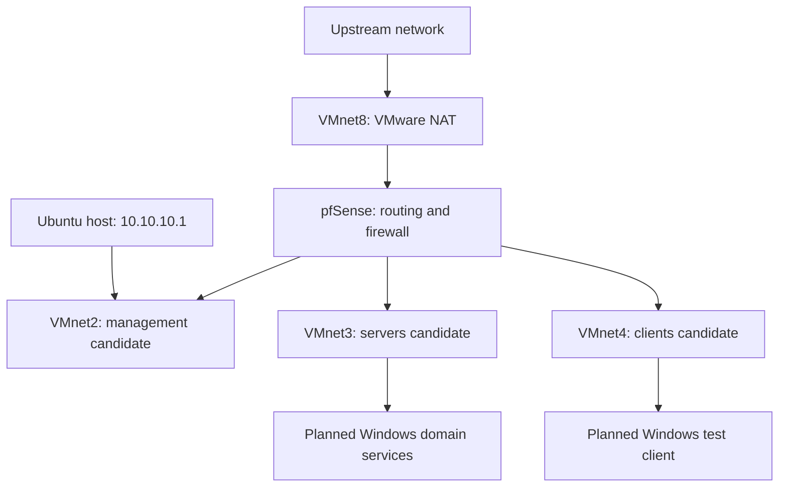

# 00 – Design Network Architecture

[Return to the project README](../README.md)

**Project:** Enterprise Home Lab  
**Status:** Design baseline; implementation in progress  
**Experience category:** Personal home lab and guided learning  
**Documentation baseline:** October 6, 2026

## Purpose

Define the virtual network foundation before introducing Windows domain services and endpoint workloads. The design separates lab functions so routing, service dependencies, and firewall decisions can be tested and documented.

This document distinguishes observed configuration from proposed roles. It does not certify that every network is connected or that segmentation controls have passed testing.

## Observed configuration

| Component | Reported observation | Evidence limitation |
|---|---|---|
| Ubuntu host / VMnet2 | Host address `10.10.10.1/24` | Does not establish pfSense address or reachability |
| VMnet3 | Subnet `10.10.20.0/24`; VMware DHCP and host adapter disabled | Network was not available in the VM adapter dropdown; resolution not recorded |
| VMnet4 | Subnet `10.10.30.0/24`; VMware DHCP and host adapter disabled | Network was not available in the VM adapter dropdown; resolution not recorded |
| VMnet8 | VMware NAT and DHCP reported running | Subnet and pfSense WAN attachment need confirmation |
| pfSense | Installation reported as version 2.9 | Exact edition, build, interface mappings, and addresses need recording |
| pfSense domain setting | `home.lab.morpheus` entered during configuration | Does not establish an Active Directory domain |

## Proposed logical topology

The topology below is a target design. The WAN mapping and internal network roles require confirmation against the running VMs.

Using VMnet8 for the pfSense WAN would provide NAT-backed outbound access without bridging lab workloads directly onto the physical LAN. If that mapping is confirmed, outbound traffic may traverse both pfSense NAT and VMware NAT; document it as a lab constraint.

The internal networks are separate virtual segments. They are not described as VLANs because VLAN tagging has not been established.

## Addressing plan

| Virtual network | IPv4 subnet | Proposed role | Gateway / device assignments |
|---|---|---|---|
| VMnet8 | To be recorded | NAT-backed WAN | Record VMware gateway and pfSense WAN lease |
| VMnet2 | `10.10.10.0/24` | Management candidate | Ubuntu host `10.10.10.1`; pfSense address pending |
| VMnet3 | `10.10.20.0/24` | Server segment candidate | pfSense and server addresses pending |
| VMnet4 | `10.10.30.0/24` | Client segment candidate | pfSense address and DHCP scope pending |

Do not assign pfSense `10.10.10.1` while the Ubuntu VMnet2 adapter owns that address. Choose and record a unique address after checking the active configuration. The subnet-to-role mapping is provisional; confirm it before applying rules or deploying servers.

## Design decisions and dependencies

### Virtual network isolation

VMnet3 and VMnet4 are intended to carry internal lab traffic. Disabling their host adapters removes the host's direct IP attachment to those networks, but does not by itself prove isolation or firewall enforcement. Connected VMs on the same virtual segment can communicate without crossing pfSense.

### Routing and management

pfSense is intended to route traffic between internal segments and apply policy at those boundaries. Record the VM NIC-to-VMnet mappings alongside the pfSense interface names. Preserve a tested management path before changing interface assignments or firewall rules.

### DNS and domain services

Before domain deployment, document the resolver used by each segment. Once AD DS and its DNS service are implemented, domain clients should use the DNS service that hosts their AD records; document its forwarding path separately. The pfSense domain setting is not evidence that an AD forest exists. The AD domain name remains undecided in this project record.

### DHCP ownership

VMware DHCP is reported disabled on VMnet3/4. Confirm DHCP ownership on VMnet2 as well. Use one intentional DHCP service per broadcast segment unless a supported coordinated design is documented. Record scope, exclusions, gateway, DNS server, and suffix before client testing.

If Windows DHCP will serve a client segment from a different subnet, record the relay design and required firewall permissions. DHCP broadcasts do not traverse a router automatically.

## Intended firewall policy

This table describes policy goals, not rules already applied or tested.

| Traffic | Intended treatment | Validation requirement |
|---|---|---|
| Approved management host to pfSense administration | Allow necessary management access | Confirm access from the approved source and denial from an unapproved source |
| Clients to designated DNS service | Allow required DNS traffic | Resolve approved internal and external names |
| Clients to domain services | Allow documented AD service dependencies | Test domain discovery, join, sign-in, and policy processing after deployment |
| Clients to approved web destinations | Allow required web traffic | Test an approved destination and a destination outside policy |
| Clients to management segment | Deny except explicit documented needs | Confirm blocked connections in firewall logs |
| Unsolicited WAN administration | Deny | Inspect WAN rules and port forwards; verify from a relevant external segment |

Define aliases before using them. A port alias such as `web_ports` represents ports, while a network alias represents addresses or subnets. Confirm what the pfSense interface named `CLIENTS` actually maps to before selecting `CLIENTS net` as a rule source. Record rule order, existing broad allow rules, and any automatic exceptions when interpreting results.

## Validation and acceptance criteria

All items below remain pending unless explicit test evidence is added.

| Check | Acceptance criterion | Evidence to record |
|---|---|---|
| VM adapter mapping | Every pfSense NIC uses the intended virtual network | VM settings and interface assignment screenshots |
| Internal network availability | VMs can attach to VMnet3/4 and communicate within their intended segment | Adapter settings and named peer tests |
| Address uniqueness | Host and pfSense use distinct addresses | Host output and pfSense interface summary |
| Gateway connectivity | A VM reaches the intended pfSense interface | Source IP, destination IP, and test output |
| DNS resolution | Queries reach the intended resolver and return expected answers | Resolver address, query, and response |
| Outbound access | A lab VM reaches an approved external service | Source segment, destination, and result |
| Segmentation | Prohibited connections fail and permitted ones succeed | Positive and negative tests with firewall log entries |
| DHCP | Client receives the intended lease and options from the intended server | Client configuration and server lease record |
| Domain integration | Client discovers and joins the documented AD domain | Domain discovery and join results after deployment |

### Existing test interpretation

The recorded host ping to `10.10.10.1` reached the host's own address; the route output identified it as local. This confirms a local response, not a pfSense gateway test. Two other connectivity tests were reported passing, but their endpoints and outputs were not included in the current evidence. Capture those details before assigning a capability to either result.

## Recovery and change control

Before changing VMnet configuration, pfSense interfaces, or routing:

1. Record the current network and adapter assignments.
2. Preserve a private pfSense configuration backup and appropriate VM recovery points.
3. Identify affected workloads and retain console access.
4. Make one scoped change and repeat the relevant tests.
5. Record the outcome and restore the prior configuration if the change breaks required access.

Do not publish raw configuration backups; they may contain sensitive information. Production designs would also require tested backups, monitoring, resilience, and formal access controls beyond this single-host lab.

## Next action

Complete the interface inventory: VMnet, pfSense interface name, NIC identifier, IPv4 address, subnet mask, role, and DHCP owner. Resolve VMnet3/4 availability and capture management and gateway tests before marking the network foundation complete.
