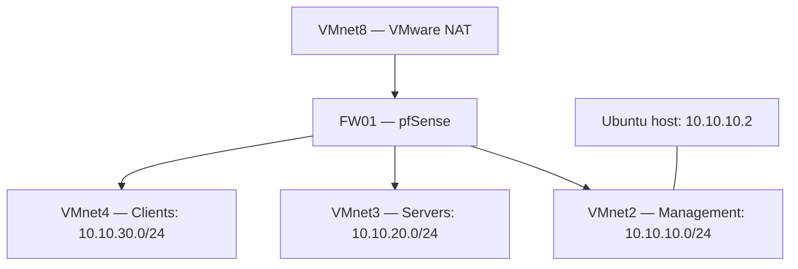

# 01 – VMware Lab Setup

## Overview

This chapter documents the VMware foundation of my Enterprise Home Lab: an Ubuntu host, separate virtual networks for management, servers, and clients, and a pfSense firewall VM connecting those networks to VMware NAT.

This is guided home-lab work, separate from my professional production experience. Configuration evidence and remaining validation are identified below.

## Objectives

- Establish a working VMware virtualization host.
- Separate management, server, and client traffic into distinct subnets.
- Route lab traffic through pfSense.
- Prevent VMware DHCP from competing with the planned Windows DHCP service.
- Document troubleshooting and verification rather than treating configuration alone as proof of connectivity.

## Host environment

| Component | Recorded configuration |
|---|---|
| Hypervisor | VMware Workstation Pro 25.0.0, build 24995812 |
| Host OS | Ubuntu 26.04.1 LTS |
| Recorded kernel | `7.0.0-38-generic` |
| CPU | Intel Core i7-1165G7, 8 logical processors |
| Virtualization capability | Intel VT-x |
| Usable RAM reported | Approximately 14 GiB |
| Filesystem capacity reported | 937 GB, with approximately 649 GB available at initial inventory |
| Secure Boot | Enabled |

Capacity values describe the initial inventory and will change as the lab grows.

## Virtual network design

The internal networks use separate `/24` subnets within the `10.10.0.0/16` address space. No overlap was reported with the host's existing networks during setup. No VLAN tagging was configured; each segment has its own VMware network and pfSense adapter.

| VMware network | Purpose | Subnet | Type | Ubuntu host adapter | VMware DHCP |
|---|---|---|---|---|---|
| VMnet8 | Firewall WAN / internet uplink | `192.168.171.0/24` | NAT | Enabled | Enabled |
| VMnet2 | Management | `10.10.10.0/24` | Host-only | Enabled | Disabled |
| VMnet3 | Servers | `10.10.20.0/24` | Host-only | Disabled | Disabled |
| VMnet4 | Clients | `10.10.30.0/24` | Host-only | Disabled | Disabled |

Ubuntu's intended management address is `10.10.10.2/24`. The gateway address `10.10.10.1` belongs to pfSense.

Host-only networks do not provide internet access by themselves. FW01 supplies the routed path to VMnet8. Disabling host adapters on VMnet3 and VMnet4 avoids giving Ubuntu a direct connection to those segments. Firewall rules are still required to enforce traffic restrictions.



The diagram shows intended connections, not verified firewall permissions.

## VMware network configuration

In the Virtual Network Editor, I configured VMnet2, VMnet3, and VMnet4 as host-only networks with mask `255.255.255.0` and disabled the local VMware DHCP service on each. Only VMnet2 has a host virtual adapter. VMnet8 retains NAT and DHCP for the firewall's WAN connection.

For VMnet3 and VMnet4, **External Connection: none** and **Host Connection: none** are intentional. Those fields do not mean that guest VMs cannot connect to the virtual networks.

## FW01 virtual machine

| Resource | Configuration observed in VMware settings |
|---|---|
| Guest | pfSense 2.9.0-RELEASE, AMD64 |
| Name | `FW01` |
| vCPU | 2 |
| RAM | 1 GB |
| Disk | 20 GB, SCSI |
| Network adapters | 4 |

The pfSense console confirmed these interface assignments:

| VMware adapter | Network | pfSense interface | Role | Address |
|---|---|---|---|---|
| Adapter 1 / `ethernet0` | VMnet8 | `em0` | WAN | DHCP; observed `192.168.171.131/24` |
| Adapter 2 / `ethernet1` | VMnet2 | `em1` | LAN / Management | `10.10.10.1/24` |
| Adapter 3 / `ethernet2` | VMnet3 | `em2` | SERVERS / OPT1 | `10.10.20.1/24` |
| Adapter 4 / `ethernet3` | VMnet4 | `em3` | CLIENTS / OPT2 | `10.10.30.1/24` |

The WAN lease can change. Interface names are specific to this VM; compare MAC addresses when reproducing the setup.

## Troubleshooting record

### VMware module rejected under Secure Boot

**Symptom:** Loading `vmmon` initially failed with `Key was rejected by service`.

**Evidence:** The module existed for the running kernel, but loading it was rejected. Later output showed both `vmmon` and `vmnet` loaded while Secure Boot remained enabled, and FW01 subsequently booted and ran pfSense.

**Conclusion:** The rejection was consistent with a module-signature trust issue. The exact signing or enrollment procedure was not captured here, so this chapter does not claim a verified remediation sequence. A future kernel or VMware update requires renewed module validation.

### Ubuntu occupied the pfSense management address

**Symptom:** Ubuntu's VMnet2 adapter initially used `10.10.10.1`, the address reserved for pfSense.

**Small change applied:** The host adapter was moved temporarily to `.2`:

```bash
sudo ip addr add 10.10.10.2/24 dev vmnet2
sudo ip addr del 10.10.10.1/24 dev vmnet2
```

**Observed result:** The route source became `10.10.10.2`.

A persistent configuration was proposed using this entry in `/etc/vmware/networking`, after checking that the installed networking binary contained the `HOSTONLY_HOSTADDR` option:

```text
answer VNET_2_HOSTONLY_HOSTADDR 10.10.10.2
```

Restart and reboot persistence must be checked explicitly. A correct address during one session does not prove persistence. A ping to `.1` is also misleading if Ubuntu itself still owns `.1`.

### VMnet3 and VMnet4 missing from the VM dropdown

**Symptom:** Both networks appeared in the Virtual Network Editor and saved configuration but were unavailable in the VM's custom-network dropdown.

**Workaround:** With FW01 powered off, Workstation closed, and the `.vmx` file backed up, custom assignments were entered directly. Existing keys were updated rather than duplicated:

```ini
ethernet0.connectionType = "custom"
ethernet0.vnet = "vmnet8"
ethernet1.connectionType = "custom"
ethernet1.vnet = "vmnet2"
ethernet2.connectionType = "custom"
ethernet2.vnet = "vmnet3"
ethernet3.connectionType = "custom"
ethernet3.vnet = "vmnet4"
```

**Observed result:** A later VMware settings screenshot showed all four custom assignments, including `/dev/vmnet3` and `/dev/vmnet4`. FW01 booted successfully. The underlying dropdown cause remains unconfirmed.

## Validation

These commands run on the Ubuntu host:

```bash
vmware --version
mokutil --sb-state
lsmod | grep -E '^(vmmon|vmnet)\b'
sudo vmware-networks --status
ip -4 -o addr show dev vmnet2
ip -4 route show dev vmnet2
ip -4 route get 10.10.10.1
```

Expected management state:

- VMnet2 has `10.10.10.2/24` and does not have `10.10.10.1`.
- Traffic to `10.10.10.1` uses VMnet2 rather than a local route to Ubuntu itself.
- VMware NAT and DHCP are running on VMnet8.
- FW01's console displays the four interface addresses documented above.

| Check | Evidence status |
|---|---|
| VMware version, hardware inventory, Secure Boot state | Recorded command output |
| VMware modules loaded | Recorded command output |
| Virtual network settings | Editor screenshot and saved configuration output |
| Host management address `.2` | Observed in command output; reboot persistence needs rechecking |
| Four FW01 adapter assignments | Observed in VMware settings screenshot |
| pfSense version and interface addresses | Observed in console screenshot |
| Server/client routing and isolation | Requires endpoint tests and firewall evidence; interface addresses alone are insufficient |

## Lab scope and next chapters

This setup provides the virtualization foundation for DC01 on VMnet3 and CL01 on VMnet4. Windows Server, AD DS, DNS, DHCP, domain joining, and Group Policy configuration belong in their respective chapters.

Workstation on a single host is a lab arrangement with a shared failure point. This chapter does not demonstrate high availability, independent backup recovery, or production security compliance. Snapshots should not be treated as independent backups.

## References

- [Broadcom: Creating subnets in VMware Workstation](https://knowledge.broadcom.com/external/article/307810/creating-subnets-in-vmware-workstation.html)
- [Netgate: Assign Interfaces](https://docs.netgate.com/pfsense/en/latest/install/assign-interfaces.html)
- [Netgate: Virtualization](https://docs.netgate.com/pfsense/en/latest/virtualization/index.html)

---

**Project:** Enterprise Home Lab  
**Chapter:** 01 – VMware Lab Setup  
**Documentation date:** October 7, 2026
